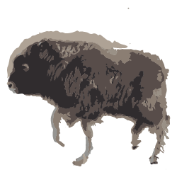

<p align="center">
  
</p>

<h1 align="center">MuskOx</h1>

<p align="center">MuskOx is an easy to use, event-driven, and efficient asset preloader for the browser.<p>

<div align="center">
	
	
	
	
	
	<a href="https://gitter.im/robertcorponoi/musk-ox?utm_source=share-link&utm_medium=link&utm_campaign=share-link">
		
	</a>
</div>

## **Installation**

MuskOx is shipped as an ES6 module.

To install MuskOx through npm, simply use the following command:

```
$ npm install musk-ox
```

## **Usage**

To use MuskOx, simply import the module:

```js
import MuskOx from './path/to/muskox.js';
```

## **Initialization**

After importing MuskOx, a new instance can be initialized like so:

```js
const ox = new MuskOx();
```

There is also currently one initialization parameter that allows you to specify a global cross origin policy for loading images from an external source. This is useful if you have a lot of assets coming from a single external source. If no value is specified, then it is left null and not used.

| param       | type   | description                                                      | default |
|-------------|--------|------------------------------------------------------------------|---------|
| crossOrigin | string | A cross origin policy to set on all assets that use cross origin | ''      |

## **Usage**

The MuskOx asset loading system is split into three steps: defining assets to load, initiating the load, and retrieving loaded assets.

## **Step 1: Defining Assets to Load**

The first step in using MuskOx involves defining the assets that need to be loaded. As of current, MuskOx supports loading images, audio, video, text, binary, and JSON assets. Assets defined during the loading phase are set to a queue that will process when the `start` method is called.

### **image**

Adds an image asset to the load queue.

| param   | type    | description                                                                             | default |
|---------|---------|-----------------------------------------------------------------------------------------|---------|
| key     | string  | A unique key which will be used to reference this image asset by when using it          |         |
| src     | string  | The path to the image asset.                                                            |         |
| replace | boolean | If set to true, this image asset will replace an existing image asset with the same key | false   |

```js
ox.image('star', './images/star.png');
```

### **audio**

Adds an audio asset to the load queue.

| param   | type                    | description                                                                                                                                               | default |
|---------|-------------------------|-----------------------------------------------------------------------------------------------------------------------------------------------------------|---------|
| key     | string                  | A unique key which will be used to reference this audio asset by when using it                                                                            |         |
| srcs    | string or Array<string> | One or more paths to the audio asset. Multiple paths can be passed as fallbacks in case the user's browser doesn't support the one or more of the formats |         |
| replace | boolean                 | If set to true, this audio asset will replace an existing audio asset with the same key                                                                   | false   |

Using a single source:

```js
ox.audio('podcast', './recordings/2019-01-01.m4a');
```

Using fallback sources:

```js
ox.audio('podcast', ['./recordings/2019-01-01.m4a', './recordings/2019-01-01.wav']);
```

### **video**

Adds a video asset to the load queue.

| param   | type                    | description                                                                                                                                               | default |
|---------|-------------------------|-----------------------------------------------------------------------------------------------------------------------------------------------------------|---------|
| key     | string                  | A unique key which will be used to reference this video asset by when using it                                                                            |         |
| srcs    | string or Array<string> | One or more paths to the video asset. Multiple paths can be passed as fallbacks in case the user's browser doesn't support the one or more of the formats |         |
| replace | boolean                 | If set to true, this video asset will replace an existing video asset with the same key                                                                   | false   |

Using a single source:

```js
ox.video('stream', './recordings/stardew-valley-1.m4a');
```

Using fallback sources:

```js
ox.video('stream', ['./recordings/stardew-valley-1.mp4', './recordings/stardew-valley-1.webm']);
```

### **text**

Adds a text asset to the load queue.

| param   | type    | description                                                                             | default |
|---------|---------|-----------------------------------------------------------------------------------------|---------|
| key     | string  | A unique key which will be used to reference this text asset by when using it           |         |
| src     | string  | The path to the text asset.                                                             |         |
| replace | boolean | If set to true, this text asset will replace an existing text asset with the same key   | false   |

```js
ox.text('bio', './documents/biography.txt');
```

### **binary**

Adds a binary asset to the load queue. Any file provided to this will be turned into a binary format.

| param   | type    | description                                                                                 | default |
|---------|---------|---------------------------------------------------------------------------------------------|---------|
| key     | string  | A unique key which will be used to reference this binary asset by when using it             |         |
| src     | string  | The path to the binary asset.                                                               |         |
| replace | boolean | If set to true, this binary asset will replace an existing binary asset with the same key   | false   |

```js
ox.binary('bio', './documents/biography.txt');
```

### **json**

Adds a JSON asset to the load queue. The JSON will be stored as a parsed object.

| param   | type    | description                                                                                 | default |
|---------|---------|---------------------------------------------------------------------------------------------|---------|
| key     | string  | A unique key which will be used to reference this JSON asset by when using it               |         |
| src     | string  | The path to the JSON asset.                                                                 |         |
| replace | boolean | If set to true, this JSON asset will replace an existing JSON asset with the same key       | false   |

```js
ox.json('movies', './documents/favorite-movies.json');
```

## **Step 2: Start Loading**

After defining all of the assets that need to be loaded, you have to tell MuskOx that you're ready for it to actually load all of
the assets by calling the `start` method.

### **start**

Starts the loading process and emits the `load-complete` event when finished.

```js
ox.start();
```

## **Step 3: Using Loaded Assets**

Since loading assets is an asynchronous action, you must wait until the `load-complete` event is emitted to ensure that all of the assets
are loaded and ready to use.

Here is an example of how to listen to the `load-complete` event:

```js
ox.on('load-complete', () => {

	// You can start using assets here.
	const star = ox.fetch.image('star');

	document.body.appendChild(star);

});
```

Retrieving assets from the cache is made possible through the `fetch` methods. By using the method that corresponds to the asset type and
the asset key, you can easily retrieve any saved asset.

### **image**

Get a saved image asset from the cache.

| param | type   | description                                         | default |
|-------|--------|-----------------------------------------------------|---------|
| key   | string | The key assigned to the image asset when loading it |         |

```js
const star = ox.fetch.image('star');
```

### **audio**

Get a saved audio asset from the cache.

| param | type   | description                                         | default |
|-------|--------|-----------------------------------------------------|---------|
| key   | string | The key assigned to the audio asset when loading it |         |

```js
const podcast = ox.fetch.audio('podcast');
```

### **video**

Get a saved video asset from the cache.

| param | type   | description                                         | default |
|-------|--------|-----------------------------------------------------|---------|
| key   | string | The key assigned to the video asset when loading it |         |

```js
const stream = ox.fetch.video('stream');
```

### **text**

Get a saved text asset from the cache.

| param | type   | description                                         | default |
|-------|--------|-----------------------------------------------------|---------|
| key   | string | The key assigned to the text asset when loading it  |         |

```js
const bio = ox.fetch.text('bio');
```

### **binary**

Get a saved binary asset from the cache.

| param | type   | description                                          | default |
|-------|--------|------------------------------------------------------|---------|
| key   | string | The key assigned to the binary asset when loading it |         |

```js
const bio = ox.fetch.binary('bio');
```

### **json**

Get a saved JSON asset from the cache.

| param | type   | description                                        | default |
|-------|--------|----------------------------------------------------|---------|
| key   | string | The key assigned to the JSON asset when loading it |         |

```js
const movies = ox.fetch.json('movies');
```

## Properties

There are also a few properties that are available:

### **assetsLoaded**

Gets the number of assets that have been loaded so far.

### **assetsToLoad**

Gets the number of assets that have yet to be loaded.

### **progress**

Gets the current loading progress as a percentage.

## License

MIT
